# Branch Tools

CLI tools for managing branches and build numbers in the TestRail repository.

## What It Does

This tool **automatically checks and adds your current branch info** in:
- `.github/workflows/ci-build-with-kiuwan-analysis.yml` - Adds branch to CI trigger list
- `.github/workflows/set-gizmo-branch-var.yml` - Maps your branch to its origin branch

It **suggests the correct build ID** for `build.txt` by:
- Scanning all remote branches to avoid conflicts
- Finding gaps in the build number sequence
- Validating the chosen number is not already taken
- Writing the validated number to the file

**Designed as a pre-commit hook** - automatically runs before each commit to ensure your branch is properly configured and has a unique build number.

## Quick Start

```bash
# 1. Install dependencies
cd tools/branch-tools
composer install
chmod +x branch-tools

# 2. Install as git pre-commit hook (recommended)
./branch-tools install-hook

# Done! Now every commit will automatically update workflows and build numbers
```

## Installation

```bash
cd tools/branch-tools
composer install
chmod +x branch-tools
```

**Quick Start (with git hook):**
```bash
# Install the pre-commit hook
./branch-tools install-hook

# Now every commit will automatically:
# - Update workflow files
# - Validate and increment build numbers
# - Stage modified files
```

## Repository Detection

All commands automatically detect the target repository by recursively searching upward from the tool's location until a git repository is found. This works even if branch-tools is installed in different locations:

- **Recommended setup:** `.git/branch-tools/` (within the target repository)
- **Alternative setup:** `tools/branch-tools/` (sibling to src/)
- **Development setup:** Any other location with access to the target repository

**How it works:**
1. Starts from the command file's directory
2. Checks each parent directory if it's a git repository
3. Skips the branch-tools repository itself if detected
4. Returns the first valid parent repository found
5. Falls back to manual path specification if auto-detection fails

**Manual repository path (optional):**
```bash
# Most commands support explicit repository path
./branch-tools prepare-commit /path/to/testrail-core
./branch-tools install-hook /path/to/testrail-core
./branch-tools build:info --repo=/path/to/testrail-core
```

**Warnings:**
- If branch-tools is detected as a standalone repository (not in `.git/`), you'll see a warning
- This indicates an improper setup - branch-tools should be installed within the target repository
- The tool will continue searching for the parent repository automatically

## Commands

### Install Hook (`install-hook`)

**Quick setup** - Installs the pre-commit hook in your repository.

**Usage:**
```bash
# Install in parent repository (default)
./branch-tools install-hook

# Install in specific repository
./branch-tools install-hook /path/to/repo
```

**What it does:**
1. Creates `.git/hooks/pre-commit` file
2. Configures it to run `prepare-commit --auto` before each commit
3. Makes the hook executable
4. Backs up any existing hook

**To uninstall:**
```bash
rm .git/hooks/pre-commit
```

**To bypass hook for a single commit:**
```bash
git commit --no-verify
```

### Prepare Commit (`prepare-commit`)

**Recommended for git hooks** - Prepares repository for commit by updating workflow files and build numbers.

**Usage:**
```bash
# Interactive mode (prompts for confirmations)
./branch-tools prepare-commit

# Auto mode (for git hooks - no prompts)
./branch-tools prepare-commit --auto

# Skip specific updates
./branch-tools prepare-commit --skip-workflows
./branch-tools prepare-commit --skip-build

# Specify repository path
./branch-tools prepare-commit /path/to/repo
```

**What it does:**
1. **Checks for staged changes** - Skips all updates if commit is empty
2. Updates workflow YAML files if on feature branch (skips main branches)
3. Validates and updates build.txt if needed
4. Double-checks build numbers against all remote branches
5. Suggests alternatives if chosen number is taken
6. Returns exit code 0 for success, 1 for failure (suitable for hooks)

**Options:**
- `--auto, -a`: Auto mode - auto-increment build and update workflows without prompts
- `--skip-workflows`: Skip workflow file updates
- `--skip-build`: Skip build number updates

**Smart empty commit detection:**
- If no changes are staged, all file updates are skipped automatically
- Useful for `git commit --allow-empty` or `git commit --amend --no-edit`
- Prevents unnecessary workflow/build number changes

**Git Hook Setup:**
```bash
# .git/hooks/pre-commit
#!/bin/bash
./tools/branch-tools/branch-tools prepare-commit --auto
exit $?
```

### Build Info (`build:info`)

Collect and analyze build.txt values from remote branches.

**Usage:**
```bash
./branch-tools build:info [options]
```

**Options:**
- `--remote, -r`: Remote name (default: origin)
- `--output, -o`: Output format: table, json, csv, list, suggest (default: table)

**Examples:**
```bash
# Show build numbers in table format
./branch-tools build:info

# Suggest available build numbers
./branch-tools build:info --output=suggest

# Export to JSON
./branch-tools build:info --output=json

# Use different remote
./branch-tools build:info --remote=upstream
```

### Workflow Update (`workflow:update`)

Update GitHub workflow files with current branch information.

**Usage:**
```bash
./branch-tools workflow:update
```

This command:
1. Detects the current branch name
2. Determines which branch it originated from using git reflog
3. Updates set-gizmo-branch-var.yml with a new case entry
4. Updates ci-build-with-kiuwan-analysis.yml branches list

### Self-Update (`self-update`)

Automatically check for and install the latest version of branch-tools from GitHub releases.

**Usage:**
```bash
# Check for available updates
./branch-tools self-update --check

# Install the latest version
./branch-tools self-update

# Force update (skip confirmation)
./branch-tools self-update --force

# Simulate update without installing
./branch-tools self-update --dry-run
```

**What it does:**
1. Queries GitHub API for the latest release
2. Compares with current version
3. Downloads and installs new version if available
4. Runs `composer install` to update dependencies
5. Creates automatic backup of current installation
6. Restores backup if update fails

**Options:**
- `--check, -c`: Only check for updates without installing
- `--force, -f`: Skip confirmation prompt
- `--dry-run`: Simulate the update without making changes

**Features:**
- Automatic version detection
- Safe update with automatic rollback on failure
- Release notes display
- Backup creation before update
- Dependency management included

**Example output:**
```
Branch Tools Self-Update
Current version: 1.0.0

Checking for updates...

Update Available
================
New version: 1.1.0
Current version: 1.0.0
Release URL: https://github.com/nop1984/branch-tools/releases/tag/v1.1.0
Published: 2026-01-15 10:30:00

Release Notes
=============
- Added self-update feature
- Improved error handling
- Bug fixes

Do you want to update to version 1.1.0? (yes/no) [yes]:
> yes

Installing Update
=================
Downloading version v1.1.0...

[OK] Successfully updated to version 1.1.0!
     Please verify the installation with: ./branch-tools --version
```

## Features

### Build Info Features
- Collects build.txt from all remote branches without pulling them locally
- Filters build numbers (minimum: 5000)
- Checks local vs remote build.txt and prompts for pull if needed
- Offers to auto-increment build numbers
- Suggests available build numbers with proper gaps
- Multiple output formats

### Workflow Update Features
- Automatic origin branch detection
- Multiple detection methods (reflog, merge-base)
- Duplicate prevention
- Detailed detection information

## Configuration

Minimum build number filter is set in `BuildInfoCommand::MIN_BUILD_NUMBER` (default: 5000).

To change it, edit `src/Command/BuildInfoCommand.php`:
```php
const MIN_BUILD_NUMBER = 5000; // Change as needed
```

## Usage Examples

### Example 1: First-Time Setup

```bash
# Create a new feature branch
git checkout -b feature/TR-12345-new-feature

# Install the pre-commit hook
cd tools/branch-tools
./branch-tools install-hook

# Make your changes
echo "console.log('new feature');" >> src/app/feature.js

# Commit (hook runs automatically)
git add .
git commit -m "Add new feature"

# Output:
# === Prepare Commit ===
# 
# → Checking workflow files...
#   Origin branch: develop
#   Detection: git reflog
# ✓ Workflow files updated
# 
# → Checking build number...
#   Current build: 6652
#   Validating build number 6653...
# ✓ Build number updated to 6653
# 
# === Summary ===
# ✓ Repository prepared for commit
#   • Workflow files updated
#   • Build number updated
# 
# ✓ Workflow files staged
# ✓ build.txt staged
```

### Example 2: Manual Workflow Update

```bash
# Switch to your feature branch
git checkout feature/my-branch

# Update workflows only
./branch-tools workflow:update

# Output:
# === GitHub Workflow Branch Updater ===
# 
# Repository: /path/to/testrail-core
# Current branch: feature/my-branch
# Origin branch: develop
# Detection method: git reflog
# Detection info: Created from develop
# 
# ✓ Added 'feature/my-branch' → 'develop' to set-gizmo-branch-var.yml
# ✓ Added 'feature/my-branch' to ci-build-with-kiuwan-analysis.yml
```

### Example 3: Finding Available Build Numbers

```bash
# Scan all remote branches and suggest build numbers
./branch-tools build:info --scan-all --output=suggest

# Output:
# Found 914 remote branches
# Found build.txt in 246 out of 914 branches
# 
# === Available Build Number Suggestions ===
# 
# Current branch: feature/my-branch
# Current build number: 6652
# 
# 📍 RECOMMENDED: 6653 (current branch increment)
# 
# Looking for gaps of at least 20 between existing build numbers...
# 
# Found 34 available build numbers:
# 
# +------------+--------------+--------------+---------+
# | Suggested  | After        | Before       | Gap     |
# +------------+--------------+--------------+---------+
# | 5040       | 5038         | 5064         | 24      |
# | 6690       | 6680         | 6802         | 112     |
# | 7120       | 7117         | 7201         | 81      |
# +------------+--------------+--------------+---------+
```

### Example 4: Build Number Conflict Resolution

```bash
# When auto-increment detects a conflict
./branch-tools prepare-commit

# Output:
# → Checking build number...
#   Current build: 6652
#   Validating build number 6653...
# 
# 🔍 Checking if build number 6653 is already taken...
#    Scanning: [246/914] vendor/celestial/...
# ⚠️  Build number 6653 is ALREADY TAKEN!
#    Found in branch: feature/other-branch
# 
# 🔍 Finding next available build number starting from 6654...
# ✓ Next available build number: 6654
# 
# Use build number 6654 instead? (y/n): y
# 
# ✓ Build number updated to 6654
```

## How Build Numbers Are Obtained and Updated

### Build Number Update Flow

```mermaid
graph TD
    A[Commit Triggered] --> B{Pre-commit<br/>Hook Installed?}
    B -->|No| Z[Manual Commit]
    B -->|Yes| C[prepare-commit --auto]
    
    C --> D{Main Branch?}
    D -->|Yes| E[Skip Workflow Updates]
    D -->|No| F[Update Workflows]
    
    F --> G[Detect Origin Branch]
    G --> H{Origin Found?}
    H -->|Yes| I[Update YAML Files]
    H -->|No| J[Skip Workflow Update]
    
    I --> K[Check Build Number]
    J --> K
    E --> K
    
    K --> L{build.txt Exists?}
    L -->|No| Z
    L -->|Yes| M[Get Local Build]
    
    M --> N[Get Remote Build]
    N --> O{Compare Builds}
    
    O -->|Local < Remote| P[ERROR: Pull Required]
    O -->|Local > Remote| Q[✓ Already Incremented]
    O -->|Local = Remote| R[Need to Increment]
    
    R --> S[Increment +1]
    S --> T[Validate Against<br/>All Remote Branches]
    
    T --> U{Number Taken?}
    U -->|Yes| V[Find Next Available]
    V --> T
    U -->|No| W[✓ Write to build.txt]
    
    W --> X[Stage Modified Files]
    X --> Y[Proceed with Commit]
    Q --> Y
    P --> AA[Abort Commit]
```



### Build Number Validation Process

```mermaid
sequenceDiagram
    participant User
    participant CLI as Branch Tools CLI
    participant Local as Local Repo
    participant Remote as Remote (914 branches)
    
    User->>CLI: prepare-commit --auto
    CLI->>Local: Read build.txt (e.g., 6652)
    CLI->>Remote: git show origin/current:build.txt
    Remote-->>CLI: 6652
    
    Note over CLI: Local == Remote<br/>Need to increment
    
    CLI->>CLI: candidate = 6653
    CLI->>Remote: Scan all branches for build.txt
    
    loop For each remote branch
        Remote-->>CLI: Branch build number
        CLI->>CLI: Check if 6653 taken
    end
    
    alt Number is available
        CLI->>Local: Write 6653 to build.txt
        CLI-->>User: ✓ Build updated to 6653
    else Number is taken
        CLI->>CLI: candidate = 6654
        Note over CLI: Repeat validation
        CLI->>Local: Write 6654 to build.txt
        CLI-->>User: ⚠️ 6653 taken, used 6654
    end
```



### Decision Tree: When to Update Build Number


### Build Number Gap Analysis

When using `--scan-all --output=suggest`, the tool finds safe build numbers by:

1. **Collecting all existing numbers** from 914 remote branches
2. **Filtering** numbers below 5000 (configurable minimum)
3. **Finding gaps** of at least 20 between consecutive numbers
4. **Recommending** the lowest available numbers first

**Example gap identification:**

```
Existing builds: 6652, 6680, 6802
                      ↓    ↑
                   Gap of 112
                   
Safe suggestions: 6690, 6700, 6710, 6720, ... 6790
```

This ensures your build number won't conflict with:
- Existing branches
- Recently merged branches still in CI
- Branches being worked on by other developers

## Development

### Running Tests

The project includes comprehensive unit tests for all output formats and features.

**Install development dependencies:**
```bash
composer install
```

**Run all tests:**
```bash
composer test
# or
./vendor/bin/phpunit
```

**Run tests with coverage:**
```bash
composer test-coverage
# Coverage report will be in coverage/index.html
```

**Run specific test:**
```bash
./vendor/bin/phpunit --filter testTableOutputFormat
```

**Test structure:**
- `tests/Command/BuildInfoCommandTest.php` - Tests for all output formats (table, json, csv, list, suggest)
- Tests verify neighbor calculation, gap detection, and edge cases
- Integration tests require a valid git repository environment

**What's tested:**
- ✅ Table output format with neighbor information
- ✅ JSON output format structure and neighbor data
- ✅ CSV output format with all columns
- ✅ List output format with detailed neighbor info
- ✅ Suggest output format with gap validation
- ✅ Neighbor calculation edge cases (first/last items)
- ✅ Gap minimum validation (20 spaces on each side)
- ✅ Empty neighbor handling (N/A display)

## Troubleshooting

**Hook not running?**
```bash
# Check if hook is executable
ls -la .git/hooks/pre-commit

# Reinstall if needed
./tools/branch-tools/branch-tools install-hook
```

**Build number conflict?**
```bash
# Manual scan to find next available
./tools/branch-tools/branch-tools build:info --scan-all --output=suggest
```

**Bypass hook for emergency commit?**
```bash
git commit --no-verify -m "Emergency fix"
```

**Reset to remote build number?**
```bash
git show origin/develop:build.txt > build.txt
```

## Credits

**Developer:** Mykola Dolynskyi (nop1984)  
**Tester:** Roman Feoktistov  
**Organization:** AgileEngine
